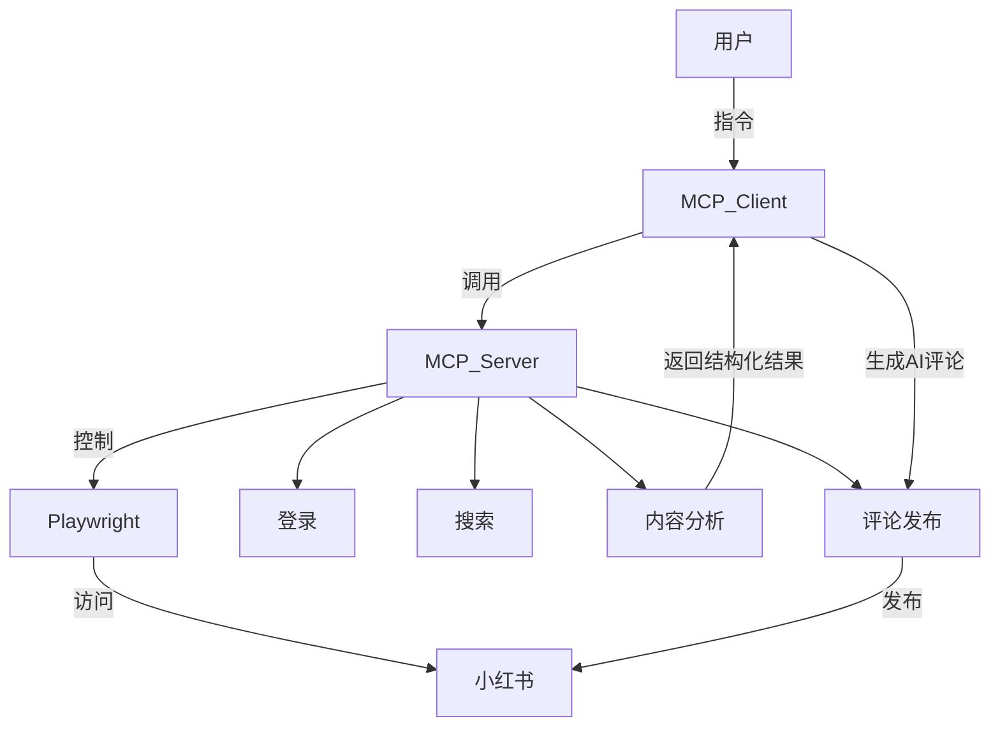

---


<div style="display: flex; flex-direction: column; align-items: center; justify-content: center; height: 100%;">
  <h1 style="font-size: 3.2rem; font-weight: bold; color: #fff; letter-spacing: 2px; margin-bottom: 0.5em; text-shadow: 0 2px 16px #ff244299;">小红书自动搜索评论工具</h1>
  <div style="font-size: 1.6rem; font-weight: 600; color: #fff; margin-bottom: 0.5em;">MCP Server 2.0 配置与使用教程</div>
  <div style="font-size: 1.1rem; color: #fff9; margin-bottom: 1.5em;">基于 <b>Playwright</b> + <b>MCP 协议</b>，支持自动登录、智能搜索与 AI 评论</div>
  
  <div class="abs-br m-8 text-white/60 text-sm">软件创新思维课程作业</div>
</div>

---
background: 'linear-gradient(135deg, #1a1a2e 0%, #16213e 100%)'
---


# 1. 项目简介

<div style="font-size: 1.2rem; color: #fff; line-height: 1.8; margin-top: 1em;">
这是一款基于 <b>Playwright</b> 开发的小红书自动搜索和评论工具，作为 MCP Server，可配合 MCP Client（如 Claude for Desktop）实现自动登录、关键词搜索、AI 评论等自动化操作。
</div>

---
background: 'linear-gradient(135deg, #1a1a2e 0%, #16213e 100%)'
---

# 2. 安装与环境准备

<div class="grid grid-cols-2 gap-6">
  <div style="background:rgba(255,255,255,0.04); border-radius: 12px; padding: 1.2em 1.5em;">
    <b style="color:#ff6b81;">① 安装 Python 3.8+</b><br>
    <span style="color:#fff;">从官网下载安装 Python 并配置环境变量。</span>
    <br><br>
    <b style="color:#ff6b81;">② 获取项目代码</b><br>
    <span style="color:#fff;">下载或克隆本项目到本地。</span>
    <br><br>
    <b style="color:#ff6b81;">③ 创建虚拟环境</b><br>
    <span class="text-sm text-white/70">Windows:</span><br>
    <code>python -m venv venv</code><br>
    <code>venv\Scripts\activate</code>
    <br><br>
    <span class="text-sm text-white/70">macOS/Linux:</span><br>
    <code>source venv/bin/activate</code>
  </div>
  <div style="background:rgba(255,255,255,0.04); border-radius: 12px; padding: 1.2em 1.5em;">
    <b style="color:#ff6b81;">④ 安装依赖</b><br>
    <code>pip install -r requirements.txt</code><br>
    <code>pip install fastmcp</code>
    <br><br>
    <b style="color:#ff6b81;">⑤ 安装 Playwright 浏览器</b><br>
    <code>playwright install</code>
    <br><br>
    <b style="color:#ff6b81;">⑥ 启动 MCP Server</b><br>
    <code>python xiaohongshu_mcp.py</code>
  </div>
</div>

---
background: 'linear-gradient(135deg, #1a1a2e 0%, #16213e 100%)'
---

# 3. 配置 MCP Client

<div style="font-size: 1.1rem; color: #fff; margin-bottom: 1em;">
以 Claude for Desktop 为例，在配置文件中添加如下内容：
</div>

```json
{
  "mcpServers": {
    "xiaohongshu MCP": {
      "command": "C:\\Users\\你的用户名\\Desktop\\MCP\\Redbook-Search-Comment-MCP2.0\\venv\\Scripts\\python.exe",
      "args": [
        "C:\\Users\\你的用户名\\Desktop\\MCP\\Redbook-Search-Comment-MCP2.0\\xiaohongshu_mcp.py",
        "--stdio"
      ]
    }
  }
}
```

<div style="color:#ff6b81; font-size:1rem; margin-top:0.5em;">
⚠️ 注意：路径需使用虚拟环境下的 python 解释器和完整 py 文件路径，Windows 路径需双斜杠。
</div>

---
background: 'linear-gradient(135deg, #1a1a2e 0%, #16213e 100%)'
---


# 4. 启动与使用演示

<div class="grid grid-cols-2 gap-6">
  <div style="background:rgba(255,255,255,0.04); border-radius: 12px; padding: 1.2em 1.5em;">
    <b style="color:#ff6b81;">① 启动 MCP Server</b><br>
    <code>python xiaohongshu_mcp.py</code>
    <br><br>
    <b style="color:#ff6b81;">② 启动 MCP Client</b><br>
    <span style="color:#fff;">按照客户端指引连接服务器。</span>
    <br><br>
    <b style="color:#ff6b81;">③ 登录小红书</b><br>
    <code>帮我登录小红书账号</code>
    <br><br>
    <b style="color:#ff6b81;">④ 搜索/评论演示</b><br>
    <code>帮我搜索小红书笔记，关键词为：美食</code>
  </div>
  <div>
    
    
    
  </div>
</div>

---
background: 'linear-gradient(135deg, #1a1a2e 0%, #16213e 100%)'
---

# 5. 常见问题与建议

<div style="font-size: 1.1rem; color: #fff; line-height: 2; margin-top: 1em;">
<ul style="list-style: disc; padding-left: 1.5em;">
  <li>路径要用虚拟环境下的 python 解释器和完整 py 文件路径</li>
  <li>Windows 路径要双斜杠</li>
  <li>首次登录需扫码，后续自动保持登录</li>
  <li>评论频率建议每天不超过 30 条，避免账号风险</li>
  <li>如遇依赖或浏览器问题，重装依赖或重启服务</li>
</ul>
</div>

---
background: 'linear-gradient(135deg, #1a1a2e 0%, #16213e 100%)'
---

# 6. 工作原理与模块说明



---
background: 'linear-gradient(135deg, #1a1a2e 0%, #16213e 100%)'
---

# 7. 免责声明

<div style="font-size: 1.1rem; color: #fff; margin-top: 1em;">
本工具仅供学习和研究，使用时请遵守相关法律法规及平台规定。
</div>

---
transition: fade-out
---

doubled.value = 2
theme: default
theme: seriph
sayHello()
